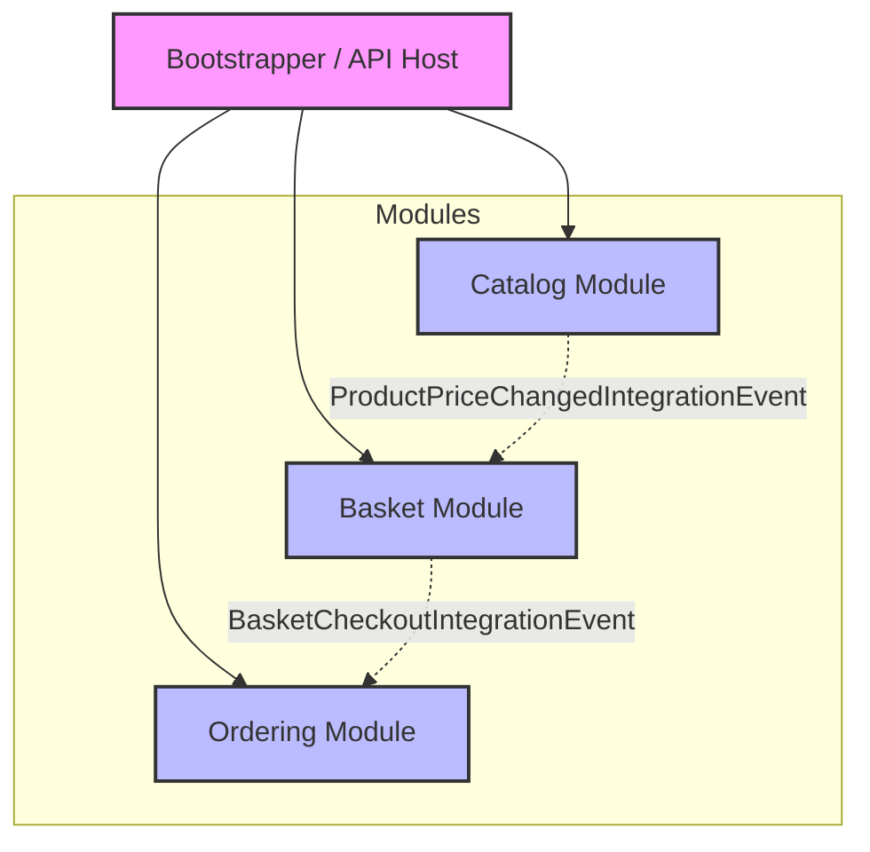

# Modular Monolith with .NET 9

This project demonstrates a Modular Monolith architecture using .NET 9 and ASP.NET Core. It is designed with Domain-Driven Design (DDD) principles and Clean Architecture.

## Architecture Overview

The solution is organized into independent modules, each encapsulating specific business capabilities. The modules communicate via integration events to maintain loose coupling.

### Modules

- **Catalog**: Manages products and their details.
- **Basket**: Handles user shopping baskets and items.
- **Ordering**: Manages order processing and fulfillment.
- **Bootstrapper**: The entry point of the application that composes the modules.

## Module Communication

The modules communicate asynchronously using **Integration Events**. This ensures that modules remain decoupled and can evolve independently.

### Integration Events

1.  **ProductPriceChangedIntegrationEvent**
    *   **Publisher**: `Catalog` Module
    *   **Subscriber**: `Basket` Module
    *   **Trigger**: When a product's price is updated in the Catalog.
    *   **Action**: The Basket module updates the price of the corresponding item in active baskets.

2.  **BasketCheckoutIntegrationEvent**
    *   **Publisher**: `Basket` Module
    *   **Subscriber**: `Ordering` Module
    *   **Trigger**: When a user checks out their basket.
    *   **Action**: The Ordering module receives the basket details and creates a new order.

## System Diagram

The following diagram illustrates the high-level architecture and module interactions:

## Technologies

- **.NET 9**
- **ASP.NET Core**
- **Entity Framework Core**
- **MediatR** (for CQRS and in-process messaging)
- **MassTransit** (likely used for integration events, inferred from architecture)
- **PostgreSQL** (inferred from `postgres_data` folder)
- **Docker**

## Getting Started

1. Ensure you have Docker and .NET 9 SDK installed.
2. Run `docker-compose up -d` to start the infrastructure (PostgreSQL).
3. Open the solution `vm.modular_monolith.sln` in your IDE.
4. Run the `Bootstrapper` project.
