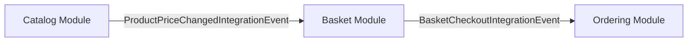

## E-Commerce Domain

This domain represents the core e-commerce functionality of the modular monolith, composed of three bounded contexts (modules):

### Modules

| Module | Responsibility |
|--------|---------------|
| **Catalog Module** | Product management — CRUD operations, pricing, categorization |
| **Basket Module** | Shopping cart — add/remove items, checkout flow |
| **Ordering Module** | Order processing — order creation, fulfillment |

### Event Flows

#### Flow 1: Price Synchronization
When a product's price is updated in the **Catalog Module**, a `ProductPriceChangedIntegrationEvent` is published via RabbitMQ (MassTransit). The **Basket Module** consumes this event and updates the price of matching items in active shopping carts.

#### Flow 2: Checkout → Order Creation
When a customer checks out in the **Basket Module**, a `BasketCheckoutIntegrationEvent` is published to the outbox and delivered via RabbitMQ. The **Ordering Module** consumes this event and creates a new order.

### Technology Stack
- **Messaging**: MassTransit + RabbitMQ
- **Persistence**: PostgreSQL + Entity Framework Core
- **Pattern**: Transactional Outbox for reliable event delivery

