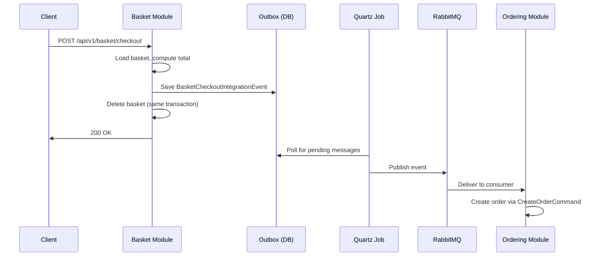

## Overview

The `BasketCheckoutIntegrationEvent` is the **core integration event** that connects the Basket and Ordering modules. It carries all the information needed to create an order: customer details, shipping address, billing address, and payment information.

This event uses the **transactional outbox pattern** — it is first persisted to the outbox table within the same database transaction that deletes the basket, then a Quartz background job publishes it to RabbitMQ.

### Flow

### Producer

**BasketModule** — The `CheckoutBasketCommandHandler`:
1. Loads the shopping cart
2. Maps checkout data to `BasketCheckoutIntegrationEvent`
3. Saves it to the outbox within a transaction
4. Deletes the basket

### Consumer

**OrderingModule** — The `BasketCheckoutIntegrationEventHandler` (MassTransit `IConsumer`):
1. Logs the incoming event
2. Maps to `CreateOrderCommand` with address, payment, and order item details
3. Dispatches the command to create the order

### Source Files

- `Basket.Application/Features/Commands/CheckoutBasket/CheckoutBasketCommandHandler.cs` — Producer
- `Basket.Domain/Events/BasketCheckoutIntegrationEvent.cs` — Event definition (Basket side)
- `Ordering.Domain/Events/BasketCheckoutIntegrationEvent.cs` — Event definition (Ordering side)
- `Ordering.Application/Features/Events/BasketCheckoutIntegrationEventHandler.cs` — Consumer

