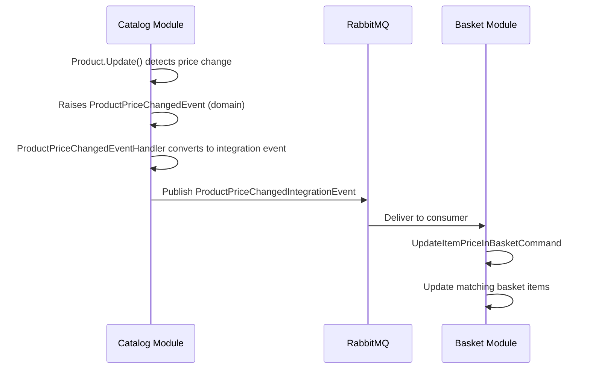

## Overview

The `ProductPriceChangedIntegrationEvent` is an **integration event** that crosses module boundaries via RabbitMQ (MassTransit).

### Flow



### Producer

**CatalogModule** — The `ProductPriceChangedEventHandler` domain event handler publishes this integration event when a `ProductPriceChangedEvent` is raised:

```csharp
var integrationEvent = new ProductPriceChangedIntegrationEvent
{
    ProductId = @event.Product.Id,
    Name = @event.Product.Name,
    Category = @event.Product.Category,
    Description = @event.Product.Description,
    ImageFile = @event.Product.ImageFile,
    Price = @event.Product.Price
};

await eventDispatcher.PublishIntegrationEventAsync(integrationEvent, cancellationToken);
```

### Consumer

**BasketModule** — The `ProductPriceChangedIntegrationEventHandler` dispatches an `UpdateItemPriceInBasketCommand` to update all baskets containing the affected product.

### Source Files

- `Catalog.Domain/Events/ProductPriceChangedEvent.cs` — Domain event
- `Catalog.Application/Features/Events/ProductPriceChangedEventHandler.cs` — Produces the integration event
- `Catalog.Domain/Events/ProductPriceChangedIntegrationEvent.cs` — Event definition (Catalog side)
- `Basket.Domain/Events/ProductPriceChangedIntegrationEvent.cs` — Event definition (Basket side)
- `Basket.Application/Features/Events/ProductPriceChangedIntegrationEventHandler.cs` — Consumer

