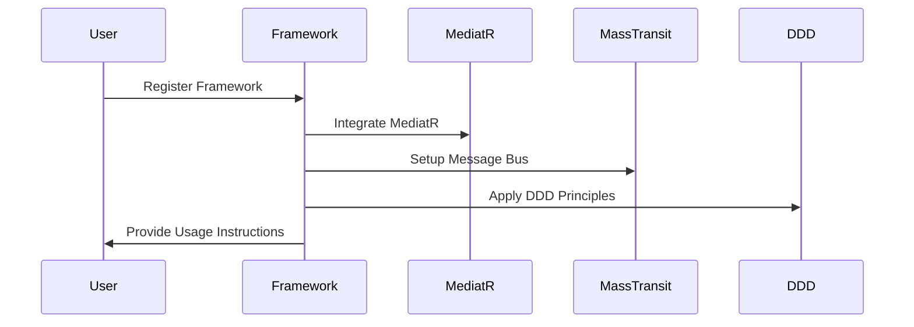

Framework Overview

🐇 "In the meadow where knowledge grows,
A readme blooms, as wisdom flows.
With features bright and guidance clear,
Hop along, dear user, have no fear!
Integration's dance, a joyful song,
In this framework, you can't go wrong!" 🎉

Sequence Diagram(s)

This framework is designed to make development easier by integrating essential features like MediatR, message bus (MassTransit with RabbitMQ), and Domain-Driven Design (DDD) principles. It helps in building scalable, maintainable, and distributed applications with minimal complexity.
Getting Started

To use this framework, register it in your Startup.cs or Program.cs (depending on your .NET version):

csharp

Services.AddFramework(configuration, typeof(DependencyInjection).Assembly);

Features
MediatR Integration

    Supports request/response patterns, commands, queries, notifications, and events.
    Handles synchronous and asynchronous operations with intelligent dispatching via C# generic variance.

Message Bus (MassTransit with RabbitMQ)

    Provides a modern, developer-friendly platform for creating distributed applications without adding unnecessary complexity.

Domain-Driven Design (DDD)

    Built with a DDD approach, supporting key patterns like AggregateRoot, Repository, UnitOfWork, ValueObject, and exception handling.

Registered Services

When you register the framework, the following services are added to the dependency injection container:
Transient Services:

    IDispatcher
    IEventDispatcher

Transient Implementations:

    ICommandHandler<TCommand, TResult>: Registers concrete command handler implementations.
    IQueryHandler<TQuery, TResult>: Registers concrete query handler implementations.
    IEventHandler<TEvent>: Registers concrete event handler implementations.

Open Generic Implementations:

    INotificationHandler<TNotification>
    IRequestExceptionHandler<TRequest, TResponse, TException>
    IRequestExceptionAction<TRequest, TResponse>

Core Components

    EntityBase
    AggregateRoot
    Repository
    UnitOfWork
    ValueObject
    Exception handling mechanisms
